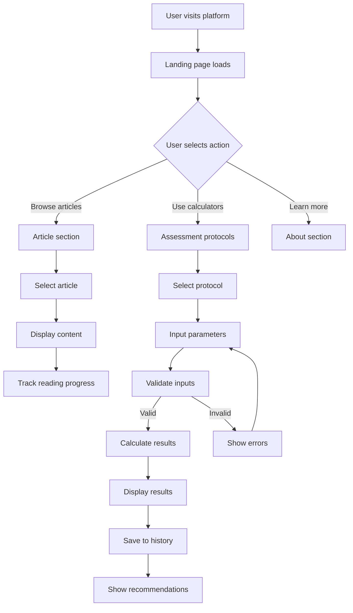
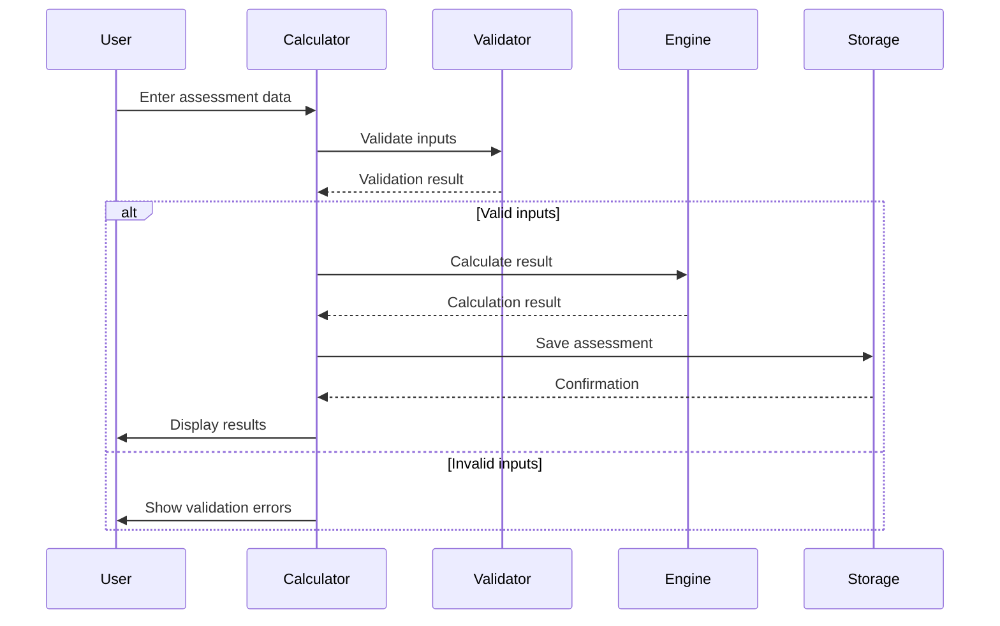
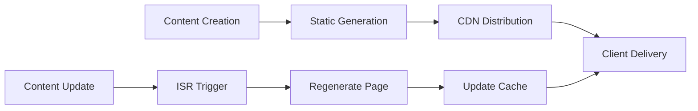

# Digital Platform Development - Performance Medicine Landing Page

## Overview

This document outlines the design for a comprehensive digital platform that serves as an institutional landing page for Performance Medicine. The platform aims to go beyond simple promotion by offering educational and functional content to users, with a focus on presenting the concept of Performance Medicine and demonstrating how medical care and science can optimize human body performance.

### Core Objectives
- Present Performance Medicine concepts with professional credibility
- Provide interactive assessment tools for physical evaluation
- Educate the public with high-quality information on medicine, health, and performance intersection
- Create an engaging user experience with clear call-to-action elements

### Target Audience
- Healthcare professionals seeking performance optimization knowledge
- Athletes and fitness enthusiasts
- Individuals interested in optimizing their physical performance
- Medical students and researchers in sports medicine

## Technology Stack & Dependencies

### Frontend Framework
- **React 18+** with TypeScript for type safety and modern development
- **Next.js 13+** for server-side rendering and optimal SEO performance
- **Tailwind CSS** for responsive design and consistent styling
- **Framer Motion** for smooth animations and micro-interactions

### UI Components & Design System
- **Radix UI** for accessible component primitives
- **Lucide React** for consistent iconography
- **Chart.js** or **Recharts** for data visualization in assessment tools

### Form Handling & Validation
- **React Hook Form** for efficient form management
- **Zod** for schema validation and type inference

### Development Tools
- **ESLint** and **Prettier** for code quality
- **Husky** for git hooks and pre-commit validation

## Component Architecture

### Component Hierarchy

```
App
├── Layout
│   ├── Header
│   │   ├── Navigation
│   │   └── CTAButton
│   └── Footer
├── HomePage
│   ├── HeroSection
│   ├── ConceptSection
│   ├── FeaturesPreview
│   └── CTASection
├── AssessmentProtocols
│   ├── ProtocolSelector
│   ├── CooperTestCalculator
│   ├── OneRMCalculator
│   ├── BodyFatCalculator
│   └── ResultsDisplay
├── ArticlesSection
│   ├── ArticleList
│   ├── ArticleCard
│   └── ArticleDetail
└── SharedComponents
    ├── Calculator
    ├── FormInput
    ├── ResultChart
    └── LoadingSpinner
```

### Component Definition

#### HeroSection Component
```typescript
interface HeroSectionProps {
  title: string;
  subtitle: string;
  ctaText: string;
  backgroundImage?: string;
  onCtaClick: () => void;
}
```

#### Calculator Component (Base)
```typescript
interface CalculatorProps {
  type: 'cooper' | 'oneRM' | 'bodyFat';
  inputs: FormInput[];
  onCalculate: (values: Record<string, number>) => void;
  result?: CalculationResult;
}

interface CalculationResult {
  value: number;
  interpretation: string;
  recommendations: string[];
  category?: string;
}
```

#### AssessmentProtocol Component
```typescript
interface AssessmentProtocolProps {
  protocol: {
    id: string;
    name: string;
    description: string;
    inputs: FormField[];
    calculation: (inputs: Record<string, number>) => CalculationResult;
  };
}
```

### State Management

Using React Context for global state management with the following providers:

- **AssessmentContext**: Manages calculator states and results
- **UserPreferencesContext**: Handles user preferences and settings
- **ContentContext**: Manages articles and educational content

```typescript
interface AssessmentState {
  currentProtocol: string | null;
  results: Record<string, CalculationResult>;
  history: AssessmentHistory[];
}
```

## Routing & Navigation

### Route Structure
```
/ (Home)
├── /protocolos (Assessment Protocols)
│   ├── /protocolos/cooper
│   ├── /protocolos/1rm
│   └── /protocolos/gordura-corporal
├── /artigos (Articles)
│   ├── /artigos/[slug]
│   └── /artigos/categoria/[category]
├── /sobre (About)
└── /contato (Contact)
```

### Navigation Component
- Responsive navigation with mobile hamburger menu
- Sticky header with smooth scrolling to sections
- Active state indicators for current page/section
- Call-to-action button prominently displayed

## Assessment Protocols Architecture

### Cooper Test Calculator

**Purpose**: Evaluate aerobic fitness based on distance covered in 12 minutes

**Input Parameters**:
- Distance covered (meters)
- Age
- Gender
- Weight (optional for enhanced analysis)

**Calculation Logic**:
```typescript
interface CooperTestInput {
  distance: number; // meters
  age: number;
  gender: 'male' | 'female';
  weight?: number;
}

function calculateCooperTest(input: CooperTestInput): CalculationResult {
  const vo2Max = (input.distance - 504.9) / 44.73;
  const category = getAerobicCategory(vo2Max, input.age, input.gender);
  
  return {
    value: vo2Max,
    interpretation: `VO2 Max: ${vo2Max.toFixed(1)} ml/kg/min`,
    category,
    recommendations: getRecommendations(category)
  };
}
```

**Results Display**:
- VO2 Max value with interpretation
- Fitness category (Excellent, Good, Average, Poor)
- Personalized recommendations
- Progress tracking capability

### 1RM (One Repetition Maximum) Calculator

**Purpose**: Estimate maximum strength for a single repetition

**Input Parameters**:
- Weight lifted
- Number of repetitions performed
- Exercise type
- Training experience level

**Calculation Methods**:
- Epley Formula: `1RM = weight × (1 + reps/30)`
- Brzycki Formula: `1RM = weight × (36/(37-reps))`
- Lander Formula: `1RM = weight × (100/(101.3-2.67123×reps))`

**Implementation**:
```typescript
interface OneRMInput {
  weight: number;
  repetitions: number;
  exercise: string;
  experience: 'beginner' | 'intermediate' | 'advanced';
}

function calculateOneRM(input: OneRMInput): CalculationResult {
  const formulas = {
    epley: input.weight * (1 + input.repetitions / 30),
    brzycki: input.weight * (36 / (37 - input.repetitions)),
    lander: input.weight * (100 / (101.3 - 2.67123 * input.repetitions))
  };
  
  const average = Object.values(formulas).reduce((a, b) => a + b) / 3;
  
  return {
    value: average,
    interpretation: `Estimated 1RM: ${average.toFixed(1)} kg`,
    recommendations: getStrengthRecommendations(input.experience, average)
  };
}
```

### Body Fat Percentage Calculator

**Purpose**: Calculate body fat percentage using scientific methods

**Supported Methods**:
1. **Navy Method** (circumference measurements)
2. **BMI-based estimation** (less accurate but accessible)
3. **Skinfold method** (7-point measurement)

**Input Parameters** (Navy Method):
- Height
- Waist circumference
- Neck circumference
- Hip circumference (for females)
- Age
- Gender

**Implementation**:
```typescript
interface BodyFatInput {
  method: 'navy' | 'bmi' | 'skinfold';
  height: number;
  weight: number;
  waist: number;
  neck: number;
  hip?: number; // Required for females
  age: number;
  gender: 'male' | 'female';
}

function calculateBodyFat(input: BodyFatInput): CalculationResult {
  switch (input.method) {
    case 'navy':
      return calculateNavyBodyFat(input);
    case 'bmi':
      return calculateBMIBodyFat(input);
    case 'skinfold':
      return calculateSkinfoldBodyFat(input);
  }
}
```

## Styling Strategy

### Design System

**Color Palette**:
- Primary: Medical blue (#2563EB) for trust and professionalism
- Secondary: Performance orange (#F97316) for energy and action
- Neutral: Sophisticated grays (#F8FAFC to #1E293B)
- Success: #059669 for positive results
- Warning: #D97706 for caution indicators
- Error: #DC2626 for alerts

**Typography Scale**:
- Headings: Inter font family for modern readability
- Body: System font stack for optimal performance
- Code/Data: JetBrains Mono for calculator displays

**Spacing System**:
- Base unit: 4px
- Scale: 4, 8, 12, 16, 24, 32, 48, 64, 96px
- Container max-width: 1200px

**Component Variants**:
```css
/* Button variants */
.btn-primary { /* Medical blue background */ }
.btn-secondary { /* Outlined version */ }
.btn-cta { /* Performance orange for CTAs */ }

/* Card variants */
.card-protocol { /* Assessment protocol cards */ }
.card-article { /* Article preview cards */ }
.card-result { /* Calculator result display */ }
```

### Responsive Design
- Mobile-first approach with breakpoints:
  - sm: 640px
  - md: 768px
  - lg: 1024px
  - xl: 1280px

## API Integration Layer

### Content Management

**Articles API Structure**:
```typescript
interface Article {
  id: string;
  title: string;
  slug: string;
  excerpt: string;
  content: string;
  author: Author;
  publishedAt: Date;
  category: Category;
  tags: string[];
  readTime: number;
  featuredImage?: string;
}

interface Category {
  id: string;
  name: string;
  slug: string;
  description: string;
}
```

**Content Fetching Strategy**:
- Static generation for articles during build time
- Incremental Static Regeneration (ISR) for content updates
- Client-side hydration for interactive elements

### Calculator Data Persistence

**Local Storage Structure**:
```typescript
interface UserAssessmentData {
  userId?: string;
  assessments: {
    [protocolId: string]: {
      results: CalculationResult[];
      lastUpdated: Date;
    };
  };
  preferences: {
    units: 'metric' | 'imperial';
    language: 'pt' | 'en';
  };
}
```

## Business Logic Architecture

### Assessment Protocol System

**Protocol Registry**:
```typescript
interface AssessmentProtocol {
  id: string;
  name: string;
  description: string;
  category: 'cardio' | 'strength' | 'body-composition';
  difficulty: 'basic' | 'intermediate' | 'advanced';
  inputs: FormField[];
  calculate: (inputs: Record<string, number>) => CalculationResult;
  validate: (inputs: Record<string, number>) => ValidationResult;
}

const protocolRegistry = new Map<string, AssessmentProtocol>();
```

**Calculation Engine**:
- Modular calculation functions for each protocol
- Input validation and sanitization
- Error handling for edge cases
- Result interpretation based on scientific standards

**Progress Tracking**:
```typescript
interface ProgressTracker {
  trackAssessment(protocolId: string, result: CalculationResult): void;
  getProgress(protocolId: string, timeframe: 'week' | 'month' | 'year'): ProgressData;
  compareResults(protocolId: string, date1: Date, date2: Date): ComparisonResult;
}
```

### Content Management Logic

**Article Categorization**:
- Performance Medicine fundamentals
- Assessment protocols and interpretations
- Training and recovery optimization
- Nutrition for performance
- Case studies and research updates

**Content Filtering and Search**:
```typescript
interface ContentFilter {
  category?: string;
  tags?: string[];
  difficulty?: 'beginner' | 'intermediate' | 'advanced';
  readTime?: 'short' | 'medium' | 'long';
}

function filterArticles(articles: Article[], filter: ContentFilter): Article[] {
  return articles.filter(article => 
    matchesCategory(article, filter.category) &&
    matchesTags(article, filter.tags) &&
    matchesDifficulty(article, filter.difficulty) &&
    matchesReadTime(article, filter.readTime)
  );
}
```

## Testing Strategy

### Component Testing
```typescript
// Example test for Cooper Test Calculator
describe('CooperTestCalculator', () => {
  test('calculates VO2 max correctly', () => {
    const input = { distance: 2400, age: 25, gender: 'male' };
    const result = calculateCooperTest(input);
    expect(result.value).toBeCloseTo(42.4, 1);
  });

  test('provides appropriate fitness category', () => {
    const input = { distance: 2800, age: 30, gender: 'female' };
    const result = calculateCooperTest(input);
    expect(result.category).toBe('excellent');
  });
});
```

### Integration Testing
- API endpoint testing for content management
- Form submission and validation testing
- Calculator accuracy testing with known values
- Cross-browser compatibility testing

### Performance Testing
- Lighthouse audits for Core Web Vitals
- Bundle size optimization testing
- Image optimization verification
- Mobile performance testing

### Accessibility Testing
- WCAG 2.1 AA compliance testing
- Screen reader compatibility
- Keyboard navigation testing
- Color contrast validation

## Data Flow Architecture

### User Interaction Flow



### Assessment Protocol Flow



### Content Management Flow



This comprehensive design document provides a robust foundation for developing a professional Performance Medicine digital platform that combines educational content with interactive assessment tools, ensuring an engaging and valuable user experience.